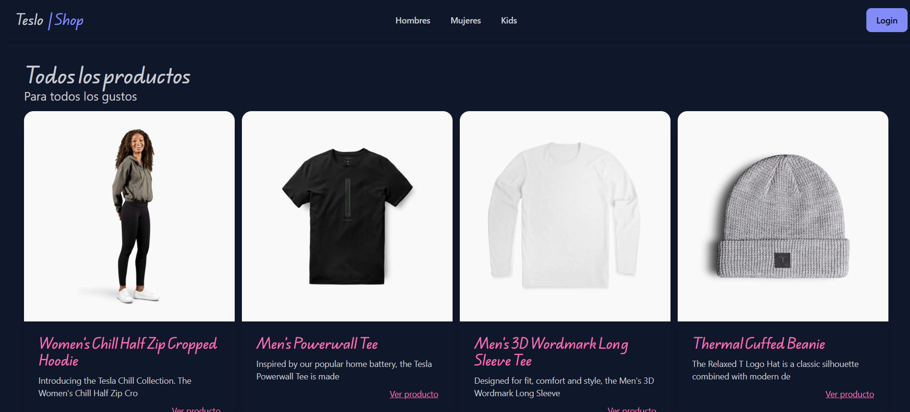
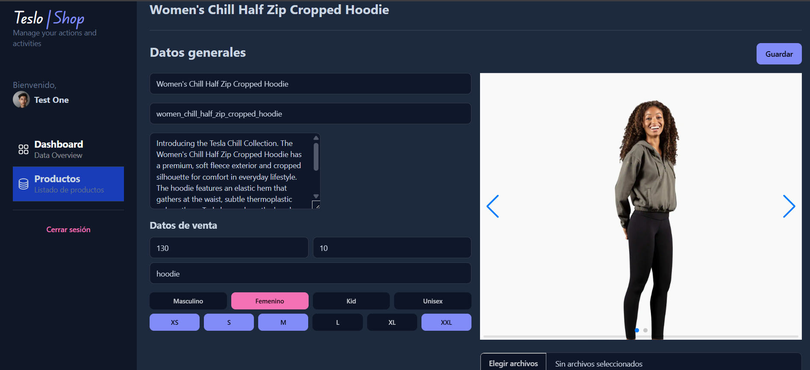

# 💳 Teslo Shop
Teslo Shop es una aplicación de comercio electrónico desarrollada con Angular. Permite la navegación por productos, visualización de detalles, paginación y búsqueda de productos. Igualmente cuenta con un panel de administración para organizar los productos.

---
## 🚀 Demo
🔗 [Ver aplicación desplegada](https://angular-teslo-shop-app.netlify.app/#/)

---

## 📸 Vista previa


## 📸 Vista previa panel administrativo


---

## 🛠️ Tecnologías utilizadas
- Angular
- Typescript 
- Tailwind  
- Daisy UI

---
## ✨ Funcionalidades principales

- Lista de productos.
- Vista de detalle de producto.
- Búsqueda y filtrado dinámico de productos.
- Panel de administración para agregar y editar productos.
---
## ⚙️ Instalación y uso
1. Clona el repositorio:  
   ```bash
   git clone https://github.com/craguila14/teslo-shop-frontend.git
2. Instala las dependencias del frontend
   ```bash
   npm install
3. Inicia el servidor del front
   ```bash
   ng serve
